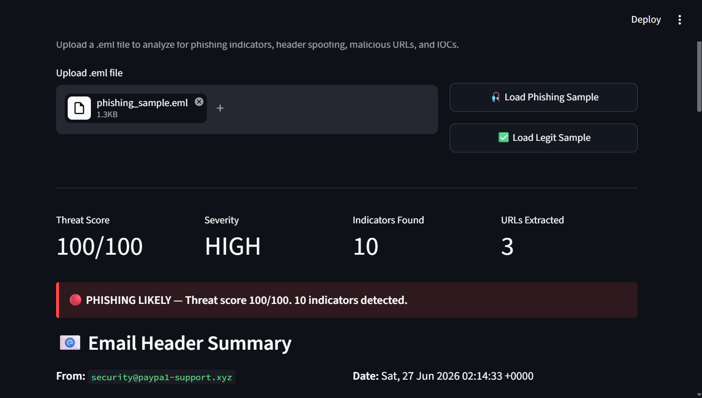
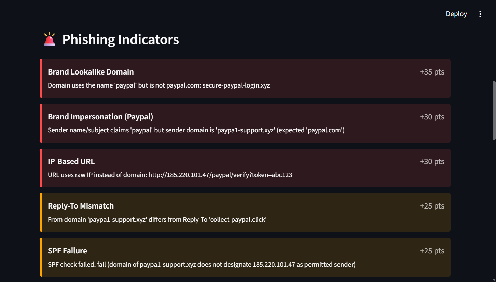
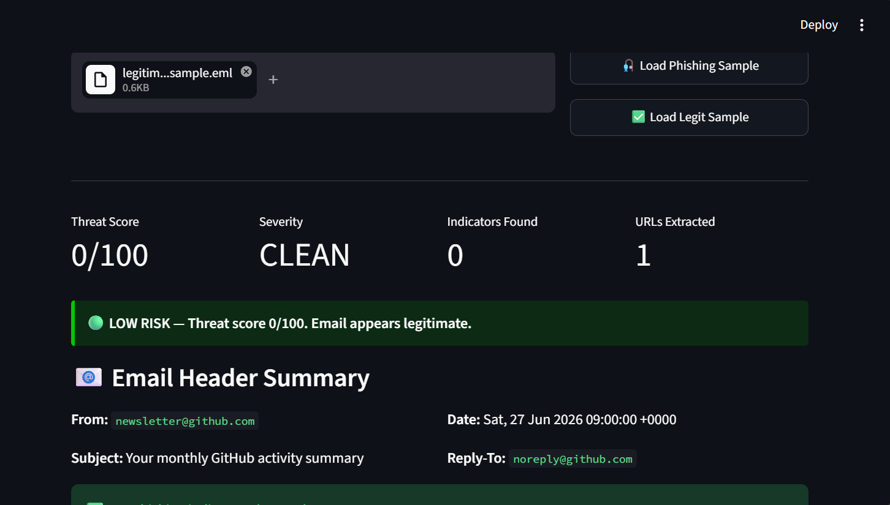

# 🎣 Phishing Email Analyzer

> A Python tool that automatically analyzes `.eml` email files for phishing indicators — header spoofing, SPF/DKIM/DMARC failures, brand impersonation, lookalike domains, malicious URLs and dangerous attachments — and produces a **0–100 threat score**, **extracted IOCs** and a **MITRE ATT&CK mapping**, with optional **VirusTotal API** URL reputation checks.

Built as a SOC analyst portfolio project by **Sai Sura** — Master's student in Intelligent Interactive Systems, Universität Bielefeld.


---

## 📸 Dashboard Preview

**Phishing email — 100/100, HIGH, 10 indicators**



**Every indicator explained with its score**



**Legitimate email — 0/100, CLEAN (no false positives)**



---

## 🎯 Problem This Solves

Phishing is one of the most common initial attack vectors in corporate breaches. A Level 1 SOC analyst spends a large part of the day triaging suspicious emails reported by employees — reading headers, checking links and looking up domains.

This tool **automates the first-pass triage**. Load a `.eml` file and get a 0–100 threat score, every indicator explained, all IOCs extracted and the matching MITRE ATT&CK techniques — in a few seconds instead of 10–15 minutes of manual work.

---

## ✨ Key Features

- **Header analysis** — Reply-To and Return-Path mismatch with the From domain
- **Email authentication checks** — SPF, DKIM and DMARC failures
- **Brand impersonation** — sender name or subject claims a brand (PayPal, Microsoft, DHL…) but the sender domain does not belong to it
- **URL analysis** — IP-based URLs, high-risk TLDs, URL shorteners and brand **lookalike domains** (e.g. `secure-paypal-login.xyz`)
- **Attachment checks** — executable/script files and double extensions (e.g. `invoice.pdf.exe`)
- **Content signals** — urgency language and known phishing phrases
- **0–100 threat score** with severity (HIGH / MEDIUM / LOW / CLEAN)
- **IOC extraction** — sender address, domains, URLs, URL domains, originating IPs, attachment names
- **MITRE ATT&CK mapping** — T1566 Phishing, T1566.002 Spearphishing Link, T1566.001 Spearphishing Attachment
- **VirusTotal API v3** URL reputation checks (optional)
- **JSON report** and **Streamlit dashboard**

---

## 🔍 What It Detects

| Check | What It Looks For | Points |
|-------|-------------------|--------|
| **Reply-To Mismatch** | Reply-To domain differs from From domain | +25 |
| **Return-Path Mismatch** | Return-Path domain differs from From domain | +20 |
| **Brand Impersonation** | Sender name/subject claims a brand, but the sender domain is not the brand's domain | +30 |
| **Brand via Free Email** | Brand claimed but sent from Gmail, Outlook, etc. | +20 |
| **IP-Based URL** | Links that use a raw IP address instead of a domain | +30 |
| **Suspicious TLD** | Domains ending in `.xyz`, `.click`, `.top`, `.tk` etc. | +20 |
| **URL Shortener** | `bit.ly`, `tinyurl.com`, `t.co` … hiding the real destination | +15 |
| **Brand Lookalike Domain** | Brand name inside a non-brand domain: `paypal.evil-site.xyz`, `secure-paypal-login.xyz` | +35 |
| **Urgency Language** | "Urgent", "Suspended", "Action required" in the subject | +15 |
| **Phishing Keywords** | Known phishing phrases in subject or body (2+ phrases) | +20 |
| **SPF Failure** | Sending server not authorized for the domain | +25 |
| **DKIM Failure** | Email signature missing or invalid | +20 |
| **DMARC Failure** | Domain's DMARC policy check failed | +20 |
| **Dangerous Attachment** | `.exe`, `.js`, `.ps1`, `.vbs`, `.hta`, `.iso` … | +40 |
| **Double Extension** | Document disguised as executable, e.g. `invoice.pdf.exe` | +35 |
| **VirusTotal (optional)** | URL flagged by 1–4 engines / by 5+ engines | +20 / +40 |

The total score is **capped at 100**.

### Threat Score → Severity

| Score | Severity | Meaning |
|-------|----------|---------|
| 60–100 | 🔴 HIGH | Phishing likely — block, report and search for other recipients |
| 30–59 | 🟠 MEDIUM | Suspicious — do not click links, verify the sender through official channels |
| 1–29 | 🟡 LOW | Probably fine — double-check if unexpected |
| 0 | 🟢 CLEAN | No indicators found |

---

## 🎯 MITRE ATT&CK Mapping

| Condition | Technique |
|-----------|-----------|
| Email scored MEDIUM or HIGH | [T1566 – Phishing](https://attack.mitre.org/techniques/T1566/) |
| Email contains URLs | [T1566.002 – Spearphishing Link](https://attack.mitre.org/techniques/T1566/002/) |
| Email contains attachments | [T1566.001 – Spearphishing Attachment](https://attack.mitre.org/techniques/T1566/001/) |

---

## 🏗️ Architecture

```
                         ┌─────────────────┐
                         │    .eml File    │
                         └────────┬────────┘
                                  ▼
                         ┌─────────────────┐
                         │  Email Parser   │  ← From, Reply-To, Return-Path,
                         │  (analyzer.py)  │    Subject, Body, URLs, Received,
                         └────────┬────────┘    Auth headers, Attachments
                                  │
   ┌──────────────┬───────────────┼───────────────┬───────────────┐
   ▼              ▼               ▼               ▼               ▼
┌─────────┐ ┌───────────┐ ┌──────────────┐ ┌────────────┐ ┌─────────────┐
│ Header  │ │   Auth    │ │    Brand     │ │    URL     │ │ Attachment  │
│Spoofing │ │SPF / DKIM │ │Impersonation │ │  Analysis  │ │  + Content  │
│ Check   │ │  / DMARC  │ │    Check     │ │   Check    │ │   Signals   │
└────┬────┘ └─────┬─────┘ └──────┬───────┘ └─────┬──────┘ └──────┬──────┘
     │            │              │         ┌─────┴──────┐        │
     │            │              │         │ VirusTotal │        │
     │            │              │         │  API v3    │        │
     │            │              │         └─────┬──────┘        │
     └────────────┴──────────────┴───────┬───────┴───────────────┘
                                         ▼
                                ┌─────────────────┐
                                │ Threat Score    │  ← 0–100 + severity
                                │ + MITRE mapping │
                                └────────┬────────┘
                                         ▼
                                ┌─────────────────┐
                                │ Report Generator│  ← JSON: indicators,
                                │                 │    IOCs, actions
                                └────────┬────────┘
                          ┌──────────────┴──────────────┐
                          ▼                             ▼
                 ┌─────────────────┐           ┌─────────────────┐
                 │   CLI Output    │           │    Streamlit    │
                 │                 │           │    Dashboard    │
                 └─────────────────┘           └─────────────────┘
```

### How it works (step by step)

1. **Parse** — Python's `email` library reads the `.eml` file (RFC-compliant) and extracts headers, body text/HTML and attachments.
2. **Check** — independent detection functions look for header, authentication, brand, URL, content and attachment indicators. Each indicator has a weight.
3. **Enrich (optional)** — up to 4 URLs are checked with the VirusTotal API v3.
4. **Score** — weights are added (maximum 100) and converted to a severity level.
5. **Map & extract** — the email is mapped to MITRE ATT&CK techniques and all IOCs are collected.
6. **Report** — results go to a JSON report, the terminal and the Streamlit dashboard.

---

## 🚀 Quick Start

### 1. Clone the repository
```bash
git clone https://github.com/surasai060/phishing-email-analyzer.git
cd phishing-email-analyzer
```

### 2. Install dependencies
```bash
pip install -r requirements.txt
```

### 3. Generate sample emails
```bash
python generate_sample_emails.py
```
Creates two test files:
- `sample_emails/phishing_sample.eml` — realistic PayPal phishing email
- `sample_emails/legitimate_sample.eml` — clean GitHub newsletter (should score 0)

### 4a. Run the CLI analysis
```bash
# Without VirusTotal
python analyzer.py sample_emails/phishing_sample.eml

# With VirusTotal API key
python analyzer.py sample_emails/phishing_sample.eml YOUR_VT_API_KEY report.json
```

### 4b. Launch the Streamlit dashboard
```bash
streamlit run dashboard.py
```
Then open **http://localhost:8501** in your browser.

---

## 📊 Sample Output (CLI)

```
[*] Analyzing: sample_emails/phishing_sample.eml
[*] Running detection checks...
[*] Skipping VirusTotal (no API key provided)
[*] Report saved to: phishing_report.json

=======================================================
  THREAT SCORE : 100/100
  SEVERITY     : HIGH
  INDICATORS   : 10
  MITRE ATT&CK : T1566 - Phishing, T1566.002 - Spearphishing Link
=======================================================

  VERDICT: PHISHING LIKELY — Threat score 100/100. 10 indicators detected.

  [ 25 pts] Reply-To Mismatch
             From domain 'paypa1-support.xyz' differs from Reply-To 'collect-paypal.click'
  [ 30 pts] Brand Impersonation (Paypal)
             Sender name/subject claims 'paypal' but sender domain is 'paypa1-support.xyz' (expected 'paypal.com')
  [ 30 pts] IP-Based URL
             URL uses raw IP instead of domain: http://185.220.101.47/paypal/verify?token=abc123
  [ 20 pts] Suspicious TLD (.xyz)
             URL uses high-risk TLD: https://secure-paypal-login.xyz/confirm
  [ 35 pts] Brand Lookalike Domain
             Domain uses the name 'paypal' but is not paypal.com: secure-paypal-login.xyz
  [ 15 pts] URL Shortener Detected
             Shortened URL hides true destination: https://bit.ly/3xPaypalVerify
  [ 15 pts] Urgency Language in Subject
             Subject contains urgency triggers: urgent, suspended
  [ 20 pts] Phishing Keywords Detected
             7 phishing phrases found: "verify your account", "unusual activity"...
  [ 25 pts] SPF Failure
             SPF check failed: fail (domain of paypa1-support.xyz does not designate 185.220.101.47 as permitted sender)
  [ 20 pts] DKIM Failure
             DKIM signature missing or invalid
```

The legitimate sample (`legitimate_sample.eml`) returns **0/100 — CLEAN**, which shows the checks do not raise false alarms on a normal newsletter.

---

## 📄 Sample Report (JSON, shortened)

```json
{
  "report_metadata": {
    "tool": "Phishing Email Analyzer",
    "threat_score": 100,
    "severity": "HIGH",
    "total_indicators": 10
  },
  "email_summary": {
    "from": "security@paypa1-support.xyz",
    "subject": "URGENT: Your PayPal account has been suspended",
    "reply_to": "no-reply@collect-paypal.click"
  },
  "mitre_attack": ["T1566 - Phishing", "T1566.002 - Spearphishing Link"],
  "iocs": {
    "sender_address": "security@paypa1-support.xyz",
    "sending_domain": "paypa1-support.xyz",
    "reply_to_domain": "collect-paypal.click",
    "urls": [
      "http://185.220.101.47/paypal/verify?token=abc123",
      "https://secure-paypal-login.xyz/confirm",
      "https://bit.ly/3xPaypalVerify"
    ],
    "url_domains": ["185.220.101.47", "secure-paypal-login.xyz", "bit.ly"],
    "originating_ips": [],
    "attachments": []
  },
  "recommended_actions": [
    "Do not click any links in the email",
    "Do not open attachments",
    "Block sender domain and URLs at email gateway and proxy",
    "Report to security team immediately",
    "Search mailboxes for other recipients and purge the email",
    "Reset credentials of any user who clicked and entered a password"
  ]
}
```

`originating_ips` is filled from the `Received` and `X-Originating-IP` headers when they exist in the email.

A full example report is in [`examples/sample_report.json`](examples/sample_report.json).

---

## 🌐 VirusTotal Integration

Get a **free API key** at [virustotal.com](https://www.virustotal.com).

- Uses the **VirusTotal API v3** URL endpoint. The URL identifier is the **base64url-encoded URL without padding**, as required by the API.
- The free tier allows **4 requests per minute**, so the tool checks **up to 4 URLs** per email.
- Results are handled clearly:
  - `malicious / suspicious / harmless / undetected` counts when VirusTotal knows the URL
  - `not_in_virustotal` when the URL has never been scanned (HTTP 404)
  - `rate_limited` when the free-tier limit is reached (HTTP 429)
  - `invalid_api_key` (HTTP 401)

```bash
# CLI
python analyzer.py email.eml YOUR_API_KEY report.json

# Dashboard: paste your key into the sidebar field (masked)
```

> ⚠️ Never hardcode your API key in the code or push it to GitHub. Pass it at runtime. `.env` files are excluded by `.gitignore`.

---

## 🕵️ How a SOC Analyst Would Use the Results

1. **Triage** — use the score and indicators to decide: phishing, spam or legitimate.
2. **Scope** — search the mail gateway for other recipients of the same sender, subject or URL (message trace).
3. **Check clicks** — search proxy/DNS logs for the extracted URL domains to see who clicked.
4. **Check credential use** — if a user entered a password, look for sign-ins from new IPs or countries.
5. **Contain** — purge the email, block the sender domain and URLs, reset affected passwords.
6. **Document** — attach the JSON report with IOCs and MITRE techniques to the incident ticket.

---

## 📁 Project Structure

```
phishing-email-analyzer/
│
├── analyzer.py                 # Core detection engine
│   ├── Email Parser            #   Headers, body, attachments
│   ├── Header Spoofing Check   #   Reply-To / Return-Path mismatch
│   ├── Auth Check              #   SPF / DKIM / DMARC results
│   ├── Brand Impersonation     #   Claimed brand vs sender domain
│   ├── URL Analysis            #   IP URLs, TLDs, shorteners, lookalikes
│   ├── Content Signals         #   Keywords + urgency language
│   ├── Attachment Check        #   Dangerous + double extensions
│   ├── VirusTotal Integration  #   URL reputation (API v3)
│   ├── MITRE Mapping           #   T1566 techniques
│   └── Report Generator        #   JSON report with IOCs
│
├── dashboard.py                # Streamlit web dashboard
├── generate_sample_emails.py   # Sample .eml generator
├── requirements.txt            # Python dependencies
├── .gitignore                  # Excludes cache, reports and secrets
├── examples/
│   └── sample_report.json      # Example output report
├── images/                     # Dashboard screenshots
└── sample_emails/
    ├── phishing_sample.eml     # Phishing test email
    └── legitimate_sample.eml   # Clean comparison email
```

---

## 🔗 How This Relates to Real SOC Work

| This Project | Real SOC Task |
|---|---|
| Header spoofing check | Manual header analysis in the email client or message trace |
| SPF / DKIM / DMARC check | Reading the `Authentication-Results` header |
| Brand impersonation + lookalike domains | "Is this really PayPal, or pretending to be?" |
| URL extraction + TLD/shortener check | Copying links into URLScan.io |
| VirusTotal API lookup | Manually submitting URLs to VirusTotal |
| MITRE ATT&CK mapping | Classifying the incident for reporting |
| JSON IOC report | Writing up indicators for the incident ticket and blocklists |

---

## ⚠️ Limitations

This is a learning and portfolio project, not a production email security gateway:

- Rule-based with **fixed weights**; real products combine rules with machine learning and reputation data.
- Tested with **generated sample emails**; real-world emails can be more complex (HTML obfuscation, encoded links).
- Does not **open or sandbox** attachments — it only checks file names.
- Brand detection uses a **small fixed brand list**.
- Lookalike detection finds brand names inside domains, but not character tricks like `paypa1` in URLs (the sender domain is still caught by brand impersonation).

---

## 🗺️ Roadmap

- [ ] Detect typosquatting with edit distance (e.g. `paypa1.com` vs `paypal.com`)
- [ ] Decode HTML links (`href` text vs real destination mismatch)
- [ ] Hash attachments (SHA-256) and check hashes on VirusTotal
- [ ] Add AbuseIPDB reputation for originating IPs
- [ ] Batch analysis of a folder of `.eml` files
- [ ] Unit tests for every detection check

---

## 🛠️ Tech Stack

- **Python 3.x** — email parsing, detection logic, IOC extraction
- **Python `email` library** — RFC-compliant `.eml` parsing
- **VirusTotal API v3** — URL reputation (optional, free tier)
- **JSON** — structured report output
- **Streamlit** — interactive web dashboard

---

## 👤 Author

**Sai Sura**  
Master's student in Intelligent Interactive Systems — Universität Bielefeld  
Background in SOC operations: alert triage, phishing analysis and incident response  
📧 surasai060@gmail.com  
🔗 [LinkedIn](https://linkedin.com/in/sai-sura-945032284) · [GitHub](https://github.com/surasai060)

---

## 📜 License

MIT License — free to use, modify, and distribute.
